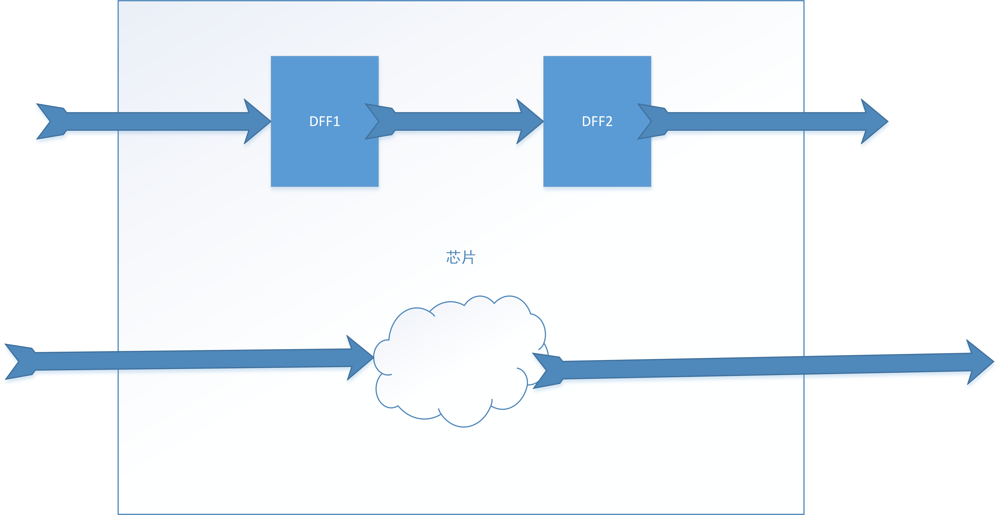
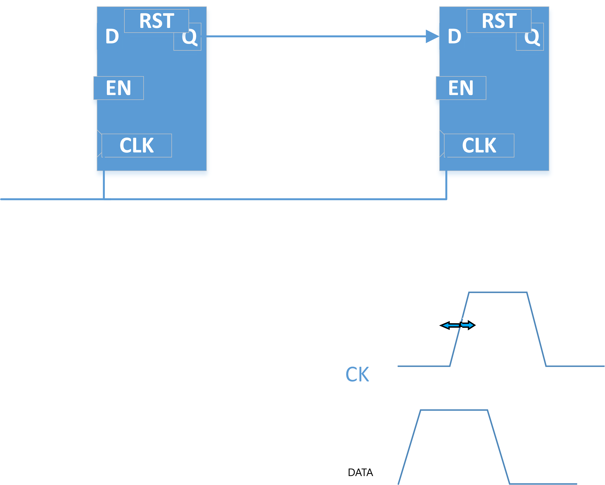
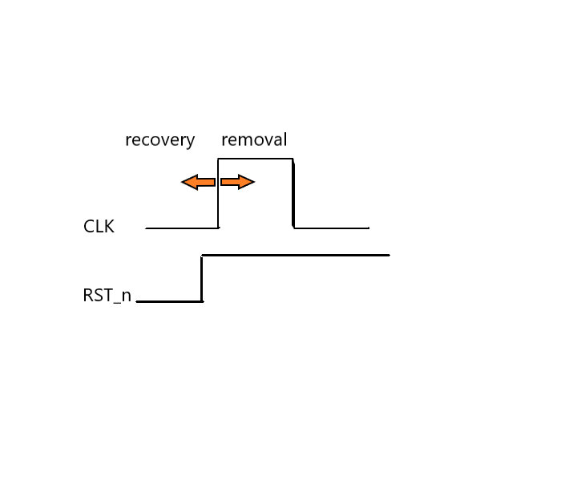
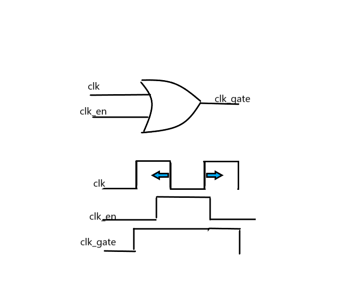

# STA
### 目录
#### 什么是STA
#### STA的四个目标
#### Clock Character
#### Clock Define
****
## 什么是STA
静态时序分许通俗来讲时检查我们的设计是否满足时序约束的要求。所谓静态与动态相对应，我们并不是通过一种实时的仿真来观察时序路径。而是通过电路模型的计算方式得到的。上面又提到了时序路径，所谓时序路径可以理解为信号在一个时钟周期内所走过的路径。主要有四种路径：从芯片外部的input port 到第一级时序单元（Sequential Cell）的路径；从一个时序单元的输出，到另一个时序单元的输入。从时序单元的输出到芯片外部的output port。或者从芯片外部的input port通过一些组合逻辑直接连接到了output port。  


## STA的四个目标
那么STA会检查什么呢？根据查找到的资料，STA会检查设计的四个方面。  
1. DFF 的 setup/hold，这里提到的DFF代表了所有所有受时钟控制的Sequential Cell。什么是 setup/hold 呢？setup建立时间是指相对于次级寄存器的时钟沿，数据需要提前多长时间到达，才能保证数据被寄存器稳定的采到，而不会出现亚稳态。hold保持时间是指当刺激寄存器的时钟沿到达后采样数据需要维持多长时间才能使采样得到的信号稳定，不至于出现亚稳态。setup/hold 的出现时由DFF内部的多级CMOS门电路的 delay 决定的。

2. 异步复位信号的recovery 和 removal。当我们的异步复位的释放信号离寄存器的时钟上升沿很近的时候就会出现，你不知道在下一个周期，寄存器是保存复位值还是采样回来了一个新值。  
  
其实有一个问题，需要注意，为什么我在上面只说了复位信号释放的时候却没有说复位信号拉低的时候呢？可以这么解释，加入我有两个寄存器，在释放时，出现违背时序要求，一个采样到新值，另一个任然维持复位值。这个时候就出现了时序问题。但是反过来，但我们把复位信号拉低时，即使在对应的时钟上升沿出现了validation，也无所谓，如果我们认为复位信号较长的话，那么一定可以在下一个时钟沿到来时，完成复位。
3. Signals pulse width：看一个信号的高（低）电平的持续宽度。例如有一个1ps的高电平，这个对于一般的CMOS电路，还没有完成输出的翻转，输入就已经回到了原始值。
4. Clock gate setup/hold：在做门控时钟的时候，通常我们将时钟信号与一个另一个信号进行逻辑运算，来屏蔽掉时钟信号的变化。如下图所示。  

当clk_en的上升沿离clk的下降沿很近的时候可能不能保证clk_gate被可靠的拉高，这个时候就可能出现时钟的毛刺。
## Clock Character
1. period
2. jitter：对于一个标称的时钟，不可能每个周期都相同，时钟周期抖动的最大值就是我们的jitter。
3. duty cycle
4. transition：上升沿和下降沿的上升，下降时间。
5. phase：通过定义第一个上升沿和第一个下降沿的时间。
6. long-term jitter：很多个jitter的平均效应，比jitter小很多。
7. input latency：从板载的晶振到时钟输入管教的延迟。
8. clock uncertainty: clock jitter + some pessimistic
9. clock tree: 为了解决一个时钟源输出能力不足和高扇出。我们将时钟插入很多的buffer，这些buffer连接成了一个树状的结构。对应到FPGA中，BUFFERG就是clock tree。
10. clock skew：同一个时钟的同一个沿，到达不同DFF Cell CK PIN 的时间差异。
## Clock Define
````TCL
create_clock -name clk \  
             -perido 10 \
             -waveform [0 5] \
             [get_port [list clk]]
set_clock_latecy 1.0 [get_clocks [list clk]]
set_clock_transition 0.1 0.15 [get_clocks [list clk]]
set_clock_uncertainty 0.2 -setup [get_clocks [list clk]]
set_clock_uncertainty 0.2 -hold [get_clocks [list clk]]
