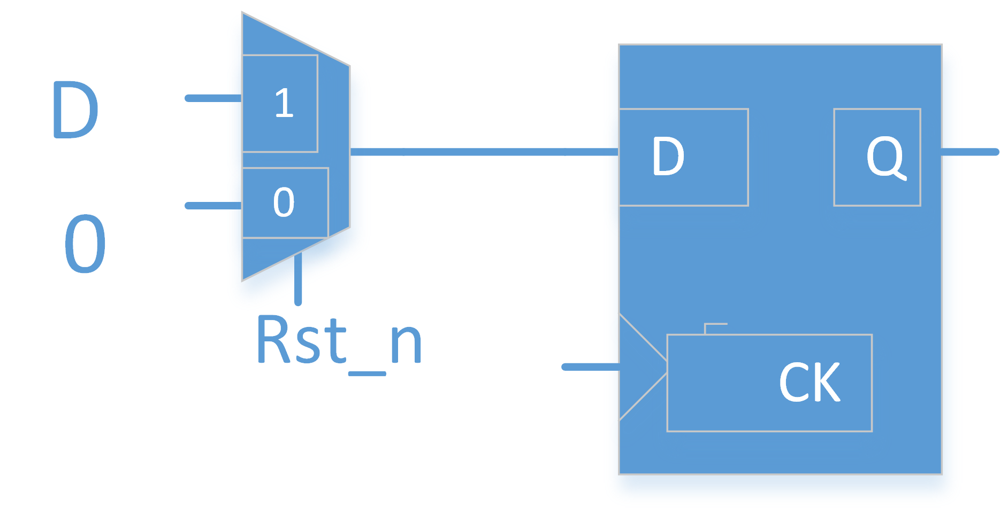

# 异步复位同步释放
### 目录
#### 异步复位和同步复位的比较
#### 异步复位为什么会造成亚稳态
#### 为什么只考虑释放问题
#### 电路设计
#### RTL代码
***
## 异步复位和同步复位的比较
1. 所谓异步复位就是，复位信号与时钟没有关系，可能在任意时刻到来。表现在RTL代码上就是复位信号，位于敏感列表，复位的产生不依赖于时钟。
2. 所谓同步复位就是在时钟到来的时候采样复位信号，决定是否复位。根据其他博客的阐述，同步复位其实并没有利用到DFF的复位端口，二十在数据端口前面加入了一个数据选择器，选择信号就是复位信号。  
     
   但是我认为所谓的同步复位在上面的要求中还需要加入一个要求就是**复位信号本身必须是同步的**，如果复位信号本身是随时到来的，那么即使不产生recovery和removal的问题，也会产生setup/hold的问题。
3. 异步复位的优点：大多数厂商的DFF提供的都是异步复位端口，使用异步复位更加节约面积。异步复位可以实现不同时钟域信号的复位。
4. 异步复位的缺点：可能会产生亚稳态；复位信号容易受到毛刺影响。
5. 同步复位的优点：避免复位信号毛刺的影响，不会出现亚稳态，保证信号同步。
6. 同步复位的缺点：复位信号的时常必须大于时钟周期，否则无法被采集到。大多数厂商的DFF提供的都是异步复位端口，同步复位浪费资源。
## 异步复位为什么会造成亚稳态
异步复位信号的recovery 和 removal。当我们的异步复位的释放信号离寄存器的时钟上升沿很近的时候就会出现，你不知道在下一个周期，寄存器是保存复位值还是采样回来了一个新值。  
  
## 为什么只考虑释放问题
其实有一个问题，需要注意，为什么我在上面只说了复位信号释放的时候却没有说复位信号拉低的时候呢？可以这么解释，假如我有两个寄存器，在释放时，出现违背时序要求，一个采样到新值，另一个任然维持复位值。这个时候就出现了时序问题。但是反过来，但我们把复位信号拉低时，即使在对应的时钟上升沿出现了validation，也无所谓，如果我们认为复位信号较长的话，那么一定可以在下一个时钟沿到来时，完成复位。
## 电路设计

图片来自：[期待YMM的博客](https://www.cnblogs.com/qidaiymm/p/4959445.html)  
rst_async_n为我们的异步复位信号，如果复位信号在接近时钟的上升沿的时候释放了，那么第一级触发器可能会产生亚稳态的问题。这个时候第二级触发器，要么复位，要么采样上一个触发器之前的值。我们知道两个值都是0，所以不存在亚稳态的问题。这个时候，产生的同步复位信号rst_sync_n仍然保持低电平，直到下一个时钟周期。第二级触发器采样到上一级触发器的高电平。完成了复位的释放。
## RTL代码
````verilog
module rst_sync_n_gen(
    output reg rst_sync_n,
    input clk,
    input rst_async_n
);
reg rst_reg1_n;
always @(posedge clk or negedge rst_async_n)begin
    if (rst_async_n==1'b0)
        {rst_reg1_n,rst_sync_n}<=2'b0;
    else
        {rst_reg1_n,rst_sync_n}<={1'b1,rst_reg1_n};
end
endmodule

````
